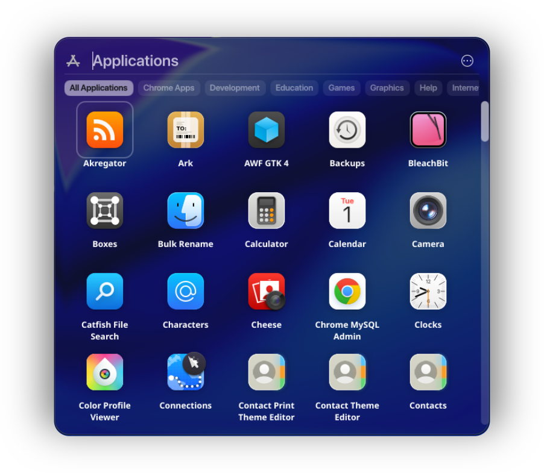

# Tahoe Launcher

A modern Launcher for KDE plasma inspired on MacOS!

## Dependencies
- KDE Plasma >= 6.0

## Easy Installation
#### KDE Store (Preferred way)
1. Right click on the desktop
2. Click on "Add Widgets"
3. Click on "Get New Widgets"
4. Click on "Download New Plasma Widgets"
5. Search for "TahoeLauncher"
6. Click on "Install" and you're done!

## Usage
1. Right click on the desktop.
2. Click "Add New Widgets"
3. Search for "TahoeLauncher"
4. Drag and drop to your desired place.

## Internationalization

If you would like to contribute by adding translations for your language, please follow the instructions in the [Translations Readme](translate/ReadMe.md).

## Support Me ♥
If you enjoy what I do, consider supporting me, every little bit means the world! 
 

## License
[GPLv3](https://www.gnu.org/licenses/gpl-3.0.en.html)